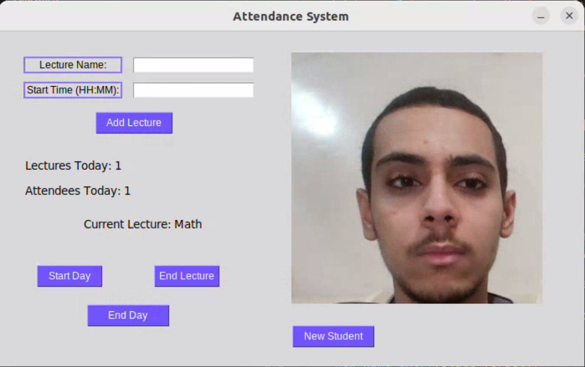

# Face Recognition Attendance System

This project is a Python-based Face Recognition Attendance System designed for educational or organizational environments. It automates attendance tracking using facial recognition via a webcam, logs attendance in CSV files, manages a schedule of lectures, and can send attendance records to Discord through a webhook.

## Features

- Face recognition and liveness detection (blink check)
- Lecture scheduling and CSV attendance logs
- GUI for easy management
- Discord webhook notification

## Requirements

- Python 3.x
- All dependencies listed in `requirements.txt`
- Dlib shape predictor model (`shape_predictor_68_face_landmarks.dat`)
- Discord webhook URL (set in the script)

## Quick Start

1. Install dependencies:
   ```bash
   pip install -r requirements.txt
   ```
2. Download and place the Dlib model in your project folder.
3. Add face images to the `photos/` directory.
4. Set your Discord webhook URL in `face_recognition_attendance.py`.
5. Run:
   ```bash
   python face_recognition_attendance.py
   ```

## Usage

- Use the GUI to add lectures and manage the schedule.
- Attendance is marked automatically for recognized and attentive faces (blink detected).
- After each lecture, a CSV log is saved and sent to your Discord channel.

## Screenshots

### Main Window After Adding Lectures


### Before and After Face Recognition

| Before Recognition               | After Attendance Is Marked        |
|:--------------------------------:|:---------------------------------:|
|       |         |

### Attendance Notification


### Attendance CSV File Example


## Authors

- [shrouqhamdy](https://github.com/shrouqhamdy)  
- [khalidashraf630](https://github.com/khalidashraf630)

---

See [`face_recognition_attendance.py`](face_recognition_attendance.py) for details.
